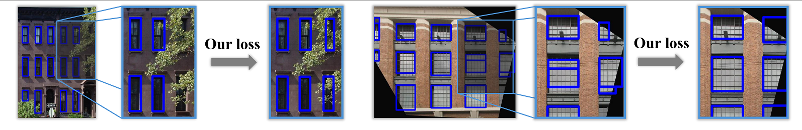
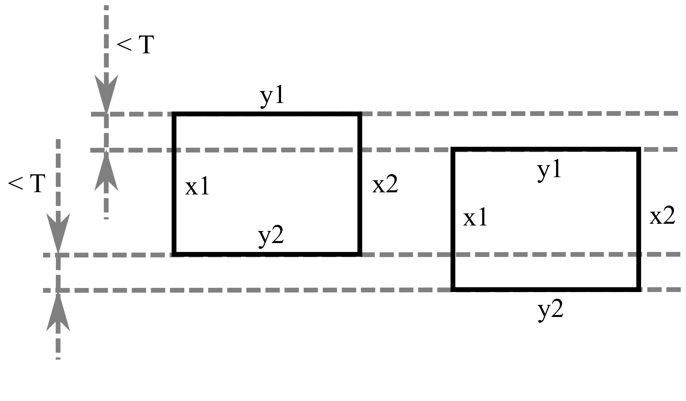

# Beyond Segmentation: Structurally Informed Facade Parsing from Imperfect Images

<p align="center">
	
</p>

## Overview

Aim of this project is to develop an automatic facade segmentation model. As a baseline, we use the Ultralytics YOLOv8 detector. We introduce a lightweight pairwise alignment regularizer that encourages consistent row/column structure among same-class predictors. It aims to correct segmentation imperfections resulting from perspective and occlusion while maintaining trade-off with standard detection accuracy.

To reach our goal, we define a loss term operating on bounding boxes selected by the YOLO assigner. For x or y axis, it identifies a pair of bounding boxes as a candidate for alignment if: they are of the same class, they don't overlap and the absolute differences between corresponding x/y coordinates are below a user-defined threshold T (as shown in the image below). If all conditions are met, the resulting loss term is equal to the absolute difference between the corresponding x/y coordinates.

The loss term is then averaged over all candidate pairs and added to the original YOLO loss term with a user-defined weight.

<p align="center">
	
</p>

## Environment

This project uses [uv](https://docs.astral.sh/uv/) for dependency management. Python 3.11+ is required (the system `python3.11` interpreter is used by default).

Install dependencies and create a virtual environment:

```bash
uv sync
```

Run scripts through uv so they use the project environment:

```bash
uv run python model/train.py
```

Or activate the virtual environment manually:

```bash
source .venv/bin/activate
python model/train.py
```

## Data Acquisition and Preprocessing

Model is trained on CMP dataset with images cropped to individual facades. Navigate to the "data" directory and run:

```bash
./prepare_dataset.sh
```

The script will download CMP dataset, preprocess it and split into training, validation and test set.

## Model Preparation

The base for this project is YOLOv8 detection model created by Ultralytics. The project modifies its loss function. In order to use the modified model, navigate to the "model" directory and run:

```bash
./prepare_model.sh
```

The script will clone the YOLOv8 repository and apply changes defined in a patch file.

## Training

Navigate to the "model" directory. In the config.py file, set the desired type ("baseline" or "align") of model, number of epochs and, in case of "align" model, threshold and weight values. Then run:

```bash
python train.py
```

Results will be saved in model/runs/train* directory (subsequent trainings will save results in "train", "train2", etc).

## Inference

For inference on a test set, navigate to the "model" directory. Set the "model_dir" variable in infer.py to the training results directory name (e.g. "train"). Then run:

```bash
python infer.py
```

Results will be saved in model/runs/infer_* (where * denotes the value of the model_dir variable). They consist of images with bouding boxes (with and without labels) and bounding boxes in a text format. In order to specify a different set of images for inference, modify the "in_dir" variable in infer.py.

## Evaluation Metrics

### Standard Metrics

Original YOLO repository provides a method for standard metrics evaluation. Navigate to the "model" and set the "model_dir" variable in val.py to the training results directory name (e.g. "train"). Then run:

```bash
python val.py
```

Results will be saved in model/runs/val_* (where * denotes the value of the model_dir variable). They consist of plots of standard metrics (like Precision, Recall, F1) and a confusion matrix. File val.txt also contains values of mAP@0.5 and mAP@0.5-0.95 metrics (in the "results_dir" field).

### SVD-based Metric

To quantify the structural coherence of the predictions, an SVD-based metric has been chosen. The regularity score is defined as the sum of Mean Squared Errors (MSE) between the original mask and its rank-k SVD approximations.

First, navigate to the "metrics" directory and run the following script to generate binary masks of detected facade elements:

```bash
python draw_boxes.py
```

Set the "baseline_dir" and the "align_dir" variables in draw_boxes.py script to the names of the directories containing segmentations for the baseline and the modified models respectively (generated according to the "Inference" section). Then run the following script:

```bash
python svd_mse.py
```

It will generate a PNG file with a graph of the MSE value for different values of k. The script will also print to the console the approximated area under plots for both the baseline and the modified model.

By default, the script uses masks of the generated windows (class 0). To use a different class of facade elements, set the "cls" variable in the svd_mse.py script to the index of the desired class (you can find the list of classes with corresponding indices in the data/classes.py file).
